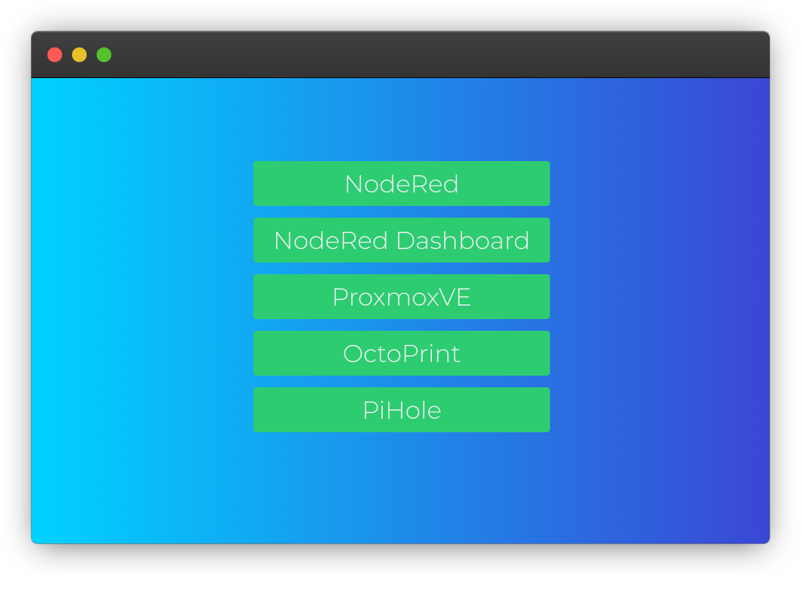

# YourRedirect
A simple redirect site for your intranet

## Getting started
1. Install apache2 if you don't have it already `apt install apache2`
2. Remove the old index.html `rm /var/www/html/index.html`
3. Download the latest index.html `wget https://raw.githubusercontent.com/xRealNeon/YourRedirect/master/index.html -P /var/www/html`
3. Edit the links on the bottom of the index.html `nano /var/www/html/index.html` `<a class="button" href="<your_link>"><name></a> `
